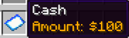
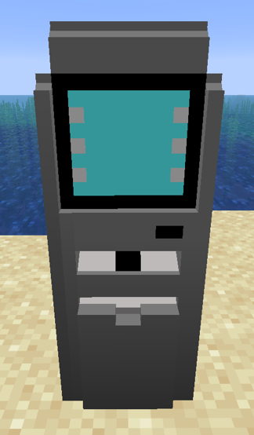
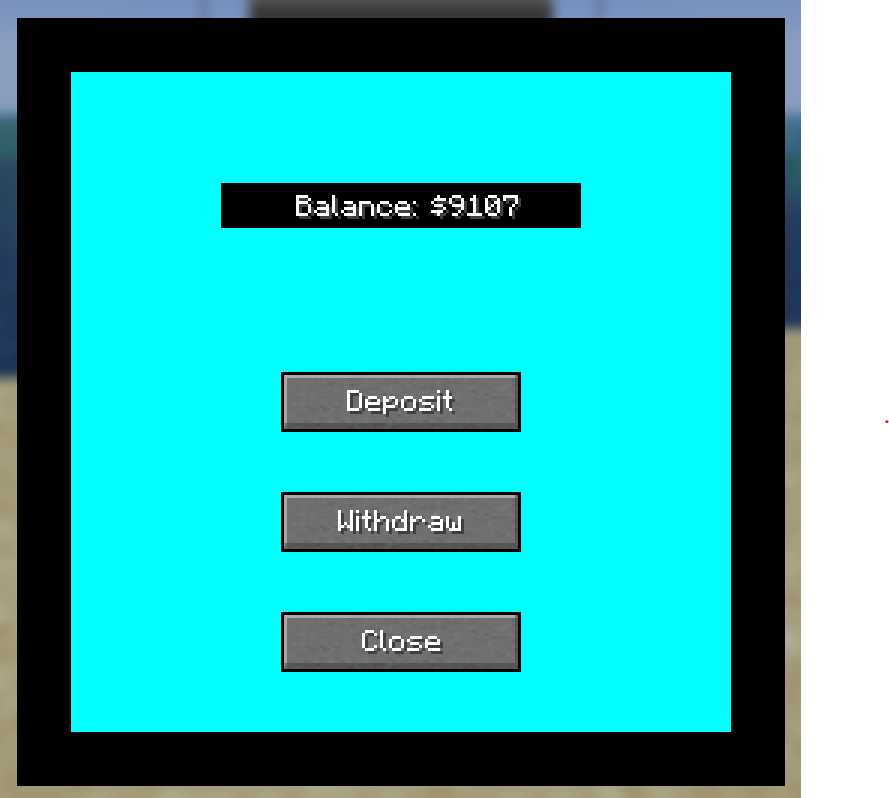
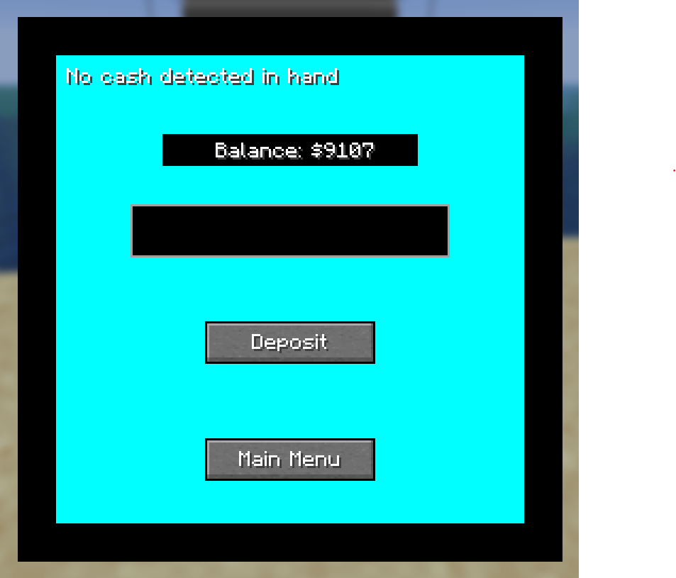
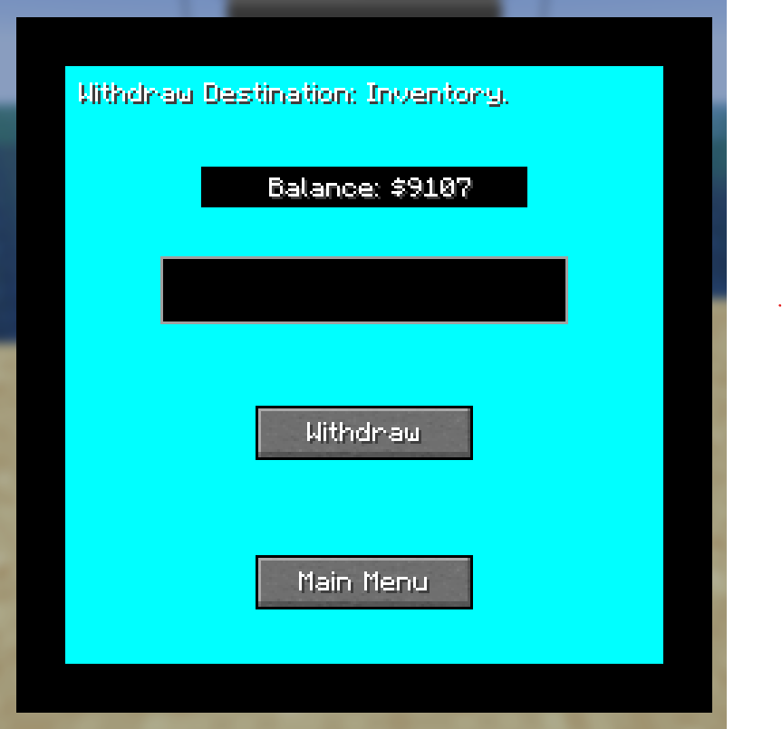

# NM Economy

## Features

### Cash
- Cash is represented by an item that stores and displays the amount.
- /split (amount) -> Splits the specified amount into a separate cash item.
- /combine -> Combines all cash  items in the players inventory into one cash item with the total amount.

### Wallet
- 5 slot item storage.
### Bank account
- Stores cash deposited by a player.
### ATM
- Allows player to make deposits or withdrawals from their bank account
- Displays bank account balance.

## Future Additions
- Debit card
- Credit card
- Loans